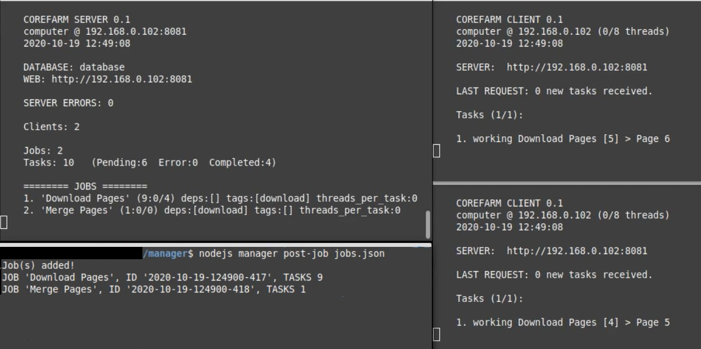

# Corefarm
Automatic management system for parallel computing tasks on Windows, Linux and MacOS. Create, manage and automatically distribute jobs to run in parallel on client computers over a network or local host.

Use cases include: render farm, data mining, web scraping, machine learning, data processing. Anything that can be parallelized.

It's free and open-source.

**WARNING: Corefarm is in early development. Incompleteness and instability may occur.**



## Overview
Corefarm is a lightweight software that aims to provide a practical way to assign and distribute process calls (aka tasks) on single or multiple computers, leveraging the distributed power of modern computing.

It aims to be easy to use, install, extend and automate.

Corefarm is made of:
* **Server**: load jobs and automatically distribute their tasks to clients;
* **Client**: receives and executes tasks from server;
* **Manager**: interface to submit jobs and manage server;

They can be installed individually in separate computers.

## Installing
*Windows, Linux, MacOS*

*Dependency-free installer isn't done yet, but current method should be straightforward:*

1. Install Node.js.\
*Current tested version is v10.19.0, but probably works with last and previous versions.*

2. [Download last Corefarm release.](https://github.com/nunocp/corefarm/releases) Unpack content of `build` folder somewhere. Client and manager folders can simply be copied to multiple computers later, after basic configuration (following steps).

3. Define **ip** and **port** for server in all configuration files (`server.json`, `client.json`, `manager.json`).

4. Move or copy these folders where you want them to be "installed" (remember to have Node.js installed on all machines). Generally, if you have several computers in a local network, you'll want to run one server and multiple clients and managers. You can use all of them in just one machine, too.

5. Allow in and out communication for **port** in the firewall settings of where server is installed. In most cases, it's not necessary for client and manager computers.

## Using
*\*Temporary\**

Run server and client(s) as normal Node.js scripts:

```
nodejs server.js
nodejs client.js
```

### Creating jobs
* A **job** is composed of one or more tasks.
* A **task** is just a call to a process, with arguments if necessary.

To create a job, we start by creating a  `.json` file describing it. Like a recipe.

We can describe its name, tasks, dependencies on other jobs, how many threads its tasks use, among other options. We can describe multiple jobs in a same file, even if they don't relate to each other.

Lets take a look at file `jobs.json` in the `example` folder included with the release:

```json
[
	{
		"name": "Download Pages",
		"tags": ["download"],
		"dependencies": [],
		"threads_per_task": 1,
		"working_dir": "../../example/",
		"tasks": [
			{
				"name": "Page 1",
				"call": "nodejs",
				"args": ["download.js", "1"]
			},
			{
				"name": "Page 2",
				"call": "nodejs",
				"args": ["download.js", "2"]
			}
		]
	},
	{
		"name": "Merge Pages",
		"tags": [],
		"dependencies": ["download"],
		"threads_per_task": 0,
		"working_dir": "../../example/",
		"tasks": [
			{
				"name": "Merge",
				"call": "nodejs",
				"args": ["merge.js", "index-1.html", "index-2.html"]
			}
		]
	}
]
```

Above, two jobs are described: "Download Pages" and "Merge Pages". Together, they download a web page two times and merge them in one file. *For details, see download.js and merge.js in example folder.*

So, lets know more about jobs description:

**name**

Can be anything or nothing.

**tags & dependencies**

* Jobs can have unlimited number of them. They are used to create dependency relationships between jobs.

> They are completely optional and may not be necessary for your jobs.

> In this example, a custom **tag** ("download") is defined for one of them and it's used as a **dependency** for the other. This means that job "Merge Pages" will only start *after* all tasks of all jobs with "download" tag are completed; in this case, "Download Pages".

**threads_per_task**

* `0` (zero) means "use all client's threads", meaning that a client will reserve all its CPU threads per task, not running new ones until it's completed. Generally used if tasks are multi-threaded (like rendering job, for example).
* `1` or more means that a client will reserve this number of threads per task, receiving and running other tasks in parallel if it still has threads available. Generally used for single-threaded tasks.

**working_dir**

* Directory where tasks will be called from. Defaults to *path/to/client/temp*.
* Avoid relative paths, they'll be relatively from client location.

> For some calls this may not be relevant.

> In this example, our tasks are Node.js calls. As `nodejs` can be called from anywhere in the system, *working_dir* will be the \"current working directory\" for a script's execution and also where Node.js will look for the respective script! So, in our example, when `nodejs download.js 1` is called, Node.js will look for script file *download.js* in described path *../../example* and execute it from there, so all filesystem operations by the script will operate relative to this *working_dir*.

**tasks**
* An array describing the actual tasks.
* Each task must have one **call** string and one **args** array (containing zero or more arguments in order). A **name** is optional.

### Submitting jobs
*Server must be running and correctly configured. Read installation instructions.*

We call Corefarm's **manager** with argument *post-job* to submit it to the (running) server:

`nodejs manager.js post-job path/to/jobs.json`

If everything is ok, server will accept it and add to its queue. That's it.

*Currently, you can find client log files in path/to/client/temp/job-id.*

### \*Current known issues\*

**These issues are high priority for fixing in next releases:**
* Server doesn't store task status (e.g. 'completed'); they're restarted every time server is started.
* To remove a job from server you have to manually delete its files on server's database folder and restart it.
* Client accumulates cache files, eating up disk storage; they have to be manually removed.
* Server doesn't disconnect unresponsive clients.

## Development
Some important things to do:

- [ ] Fix current issues (see above).
- [ ] Dependency-free release; installer with all included.
- [ ] GUI interface.
- [ ] Server's REST API and manager's CLI arguments.
- [ ] Security layers like https, user accounts with limited access, process blacklist/whitelist.
- [ ] Proper documentation.

## Building
*\*Soon\**

## Contributing
Feel free to contribute!

## License
This project is free software; you can use it for any purpose and redistribute it and/or modify it under the terms of the zlib license, as in [LICENSE.md](LICENSE.md):

```
Copyright (c) 2020 Nuno Chinaglia Poli

This software is provided 'as-is', without any express or implied warranty. In no event will the authors be held liable for any damages arising from the use of this software.

Permission is granted to anyone to use this software for any purpose, including commercial applications, and to alter it and redistribute it freely, subject to the following restrictions:

    1. The origin of this software must not be misrepresented; you must not claim that you wrote the original software. If you use this software in a product, an acknowledgment in the product documentation would be appreciated but is not required.

    2. Altered source versions must be plainly marked as such, and must not be misrepresented as being the original software.

    3. This notice may not be removed or altered from any source distribution.

```

## Credits
Created by Nuno Chinaglia Poli.
